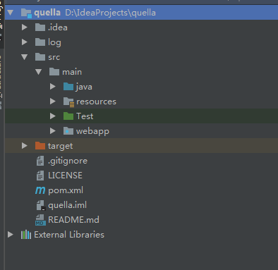
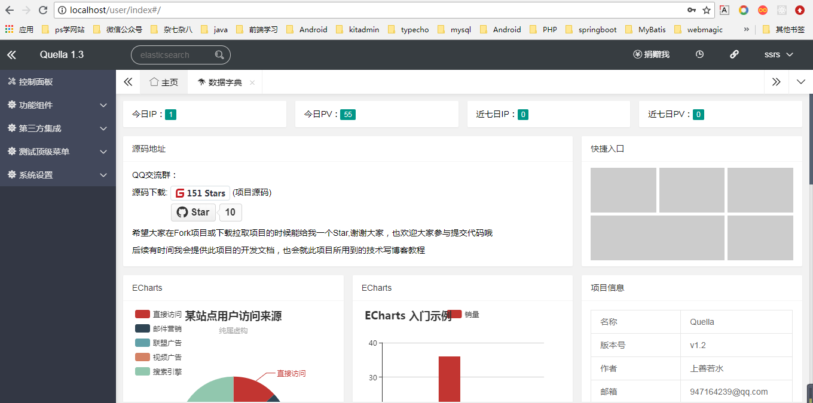
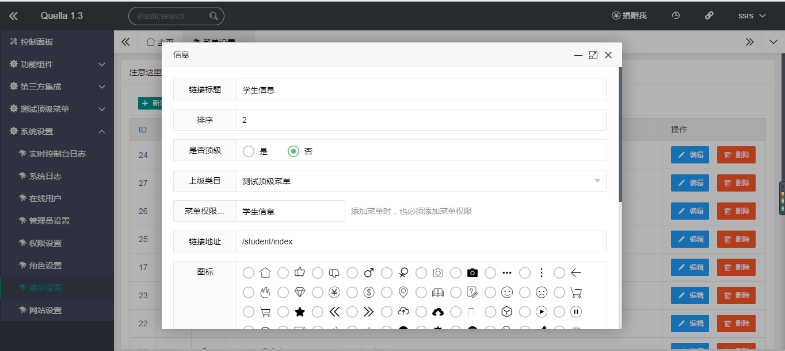

## 一、简介

### 1.1 概述
Quella是基于SSM+shiro+redis为基础框架开发的后台脚手架，集成了一些后台通用功能，并集成了一些常用的第三方服务。致力于使开发者快速进行二次开发。

如果想要彻底搞懂Quella，推荐学习技术栈：Spring > SpringMvc > Mybatis > MybatisPlus > Layui >  Freemaker  >  Shiro > Redis > Freemaker

"Quella"中译英为"杀手"的意思,亦有“杀人红尘中，脱身白刃里”的感觉，正符合这个项目的意境。
### 1.2 特性
- 简单：将源码下载后，启动Redis服务，修改jdbc.properties 即可直接在tomcat部署；
- 双视图：采用了Freemaker与JSP两种模板视图，开发者可选择自己熟悉的模板视图；
- 页面路由：后台页面框架使用了路由方式，减少资源浪费。
- 实时控制台日志：更好的监控系统的运行状态，也方便开发者或运维人员系统发生bug时定位问题所在地；
- 权限细粒度：权限细粒度做到了最小界面，即一切都可控。
- 站点统计：模仿百度统计实现站点的统计
- 第三方集成：集成一些业务所需要的第三方，迅速进行二次开发，无需再去对接第三方。
- 功能组件标签调用：将一些常用组件，如图片播放器做成自定义标签。
- 搜索：集成ElasticSearch做为分布式搜索引擎
- 完美整合Redis作为Mybatis的二级缓存框架
- 使用SpringAOP+自定义注解做Redis缓存（主要是解决Mybatis二级缓存脏读，可使用自定义注解完全代替mybatis二级缓存）
- 定时任务分布式：使用xxl-job分布式任务调度平台做Quella的定时任务分布式的解决方案。（开发中）
- mysql优化：使用mycat做mysql的分库分表和读写分离。（开发中）

### 1.4 下载

#### 源码仓库地址

源码仓库地址 | Release Download
--- | ---
[https://github.com/fengbindev/Quella](https://github.com/fengbindev/Quella) | [Download](https://gitee.com/quella01/Quella/releases)
[https://gitee.com/quella01/Quella/](https://gitee.com/quella01/Quella/) | [Download](https://gitee.com/quella01/Quella/releases)

#### 技术交流
- QQ群：891137268

### 1.5 环境
- JDK 1.8+
- Tomcat 7+
- mysql 5.7+
- redis 3.0+
- ElasticSearch 6.4.2 (非必要)
- 开发工具IDEA **（需要安装lombok插件）**

### 1.6 参与贡献
欢迎各路好汉一起来参与完善 Quella，我们期待你的 PR！

### 1.7 项目结构

    -----bo              业务对象
    ----common           公共类
    ----controller       前端控制器
    ----core             核心功能：shiro集成、定时任务等
       ---config         配置类
       ---freemaker      freemaker标签扩展
       ---manager        分页数据、菜单数据等数据构建类
       ---shiro          shiro集成相关
       ---timer          定时任务
       ---websocket      通讯相关
    ----interceptor      过滤器
    ----mapper           mybatis的mapper接口类
       ---xml            mybatis.xml 文件
    ----model            数据库实体类
    ----permission       权限功能业务
    ----service          业务接口
       ---impl           业务实现
    ----util             帮助类
    ----vo               临时实体类

## 二、快速开始

### 2.1 初始化数据库
请下载源码并解压，在 /src/java/SQL/ 里找到对应版本的sql文件，执行即可。
然后以maven格式将源码导入IDE，使用maven编译即可。
初始化完后的项目结构为：



**注意:resoures 文件夹要作为Resources Root 文件夹。**

### 2.2 项目配置
- 1. 修改jdbc.properties 文件，改为自己的数据库链接属性
- 2. 修改spring-cache.xml 文件，改为自己的redis链接属性
- 3. 修改spring-elasticsearch.xml 文件，改为自己的elasticsearch链接属性（非必要）

### 2.3 部署项目
**必须先开启redis服务，否则项目无法启动！！！**

如果已经正确进行上述配置，可将项目编译打包部署或者在IDE中配置好Tomcat。然后启动，
这里使用根路径启动，没有配置项目的上下文，所以浏览器访问：http://localhost
跳转到登录页面。

初始账号为：ssrs@qq.com

初始密码：admin

登录成功后的界面为


需要注意的是我用的ElasticSearch为6.4.2 版本，es6.x版本使用的log4j2的2.11.1版本，而log4j2-2.11.1需要jdk9,但是我的环境是jdk1.8,所以tomcat启动会报

```
Unable to process Jar entry [META-INF/versions/9/module-info.class] from Jar [jar:file:/D:/IdeaProjects/quella/target/quella/WEB-INF/lib/log4j-api-2.11.1.jar!/] for annotations
org.apache.tomcat.util.bcel.classfile.ClassFormatException: Invalid byte tag in constant pool: 19

```
但是不会影响使用。
解决方法：1.降低es版本，2.提高jdk版本，3.在pom文件排除es的log4j2依赖，自己引入2.11一下版本


## 三、普通页面的CRUD
在部署成功后，就开始真正的编码吧，如何在Quella上快速进行二次开发，当你跟着这个步骤做完，你会发现写一个业务的CRUD是如此简单、快速。

###  1. 创建学生信息表

        CREATE TABLE `ssrs_student` (
          `id` bigint(20) NOT NULL AUTO_INCREMENT,
          `stu_name` varchar(50) NOT NULL COMMENT '学生姓名',
          `stu_age` int(3) NOT NULL COMMENT '学生年龄',
          `stu_grade` float NOT NULL COMMENT '学生成绩',
          `stu_number` varchar(20) DEFAULT NULL COMMENT '学号',
          `stu_create_time` datetime NOT NULL COMMENT '创建日期',
          PRIMARY KEY (`id`)
        ) ENGINE=InnoDB DEFAULT CHARSET=utf8mb4 COMMENT='学生信息表';

### 2. 使用代码生成器进行逆向工程
找到 /src/main/Test/com.ssrs.mp/TestGenerator.java  修改为自己的配置

         /**
          * 代码生成    示例代码
          */
         @Test
         public void  testGenerator() {
             //1. 全局配置

             GlobalConfig config = new GlobalConfig();
             config.setActiveRecord(false) // 是否支持AR模式
                     .setAuthor("ssrs") // 作者
                     .setOutputDir("G:\\Quella\\src\\main\\java") // 生成路径
                     .setFileOverride(true)  // 文件覆盖
                     .setIdType(IdType.AUTO) // 主键策略
     //                .setServiceName("%sService")  // 设置生成的service接口的名字的首字母是否为I
                     // IEmployeeService
                     .setBaseResultMap(true)
                     .setBaseColumnList(true);

             //2. 数据源配置
             DataSourceConfig dsConfig  = new DataSourceConfig();
             dsConfig.setDbType(DbType.MYSQL)  // 设置数据库类型
                     .setDriverName("com.mysql.jdbc.Driver")
                     .setUrl("jdbc:mysql://localhost:3306/quella2")
                     .setUsername("root")
                     .setPassword("1234");

             //3. 策略配置
             StrategyConfig stConfig = new StrategyConfig();
             stConfig.setCapitalMode(true) //全局大写命名
                     .setDbColumnUnderline(true)  // 指定表名 字段名是否使用下划线
                     .setNaming(NamingStrategy.underline_to_camel) // 数据库表映射到实体的命名策略
                     .setTablePrefix("ssrs_")
                     .setInclude("ssrs_student");  // 需要生成的表名

             //4. 包名策略配置
             PackageConfig pkConfig = new PackageConfig();
             pkConfig.setParent(null)
                     .setMapper("com.ssrs.mapper")
                     .setService("com.ssrs.service")
                     .setServiceImpl("com.ssrs.service.impl")
                     .setController("com.ssrs.controller")
                     .setEntity("com.ssrs.model")
                     .setXml("com.ssrs.mapper.xml");

             //5. 整合配置
             AutoGenerator ag = new AutoGenerator();

             ag.setGlobalConfig(config)
                     .setDataSource(dsConfig)
                     .setStrategy(stConfig)
                     .setPackageInfo(pkConfig);

             //6. 执行
             ag.execute();
         }

修改好了后运行这个方法，就会生成model、mapper接口，mybatis的xml文件，service接口，service接口的实现，controller
然后去到xml文件把上面的二级缓存配置**删除**

          <!-- 开启二级缓存 -->
         <cache type="org.mybatis.caches.ehcache.LoggingEhcache"/>

完整配置

    <?xml version="1.0" encoding="UTF-8"?>
    <!DOCTYPE mapper PUBLIC "-//mybatis.org//DTD Mapper 3.0//EN" "http://mybatis.org/dtd/mybatis-3-mapper.dtd">
    <mapper namespace="com.ssrs.mapper.StudentMapper">


        <!-- 通用查询映射结果 -->
        <resultMap id="BaseResultMap" type="com.ssrs.model.Student">
            <id column="id" property="id" />
            <result column="stu_name" property="stuName" />
            <result column="stu_age" property="stuAge" />
            <result column="stu_grade" property="stuGrade" />
            <result column="stu_number" property="stuNumber" />
            <result column="stu_create_time" property="stuCreateTime" />
        </resultMap>

        <!-- 通用查询结果列 -->
        <sql id="Base_Column_List">
            id, stu_name, stu_age, stu_grade, stu_number, stu_create_time
        </sql>

    </mapper>

然后去到生成的Mode类，删除get、set、toString方法，再在Mode类上方添加@Data注解。当然这个步骤并不是必须的，这样只是减少代码体积以及方便修改。具体说明请百度 lombok

完整的model

    /**
     * <p>
     * 学生信息表
     * </p>
     *
     * @author ssrs
     * @since 2018-11-09
     */
    @Data
    @TableName("ssrs_student")
    public class Student implements Serializable {

        private static final long serialVersionUID = 1L;

        @TableId(value = "id", type = IdType.AUTO)
        private Long id;
        /**
         * 学生姓名
         */
        private String stuName;
        /**
         * 学生年龄
         */
        private Integer stuAge;
        /**
         * 学生成绩
         */
        private Float stuGrade;
        /**
         * 学号
         */
        private String stuNumber;
        /**
         * 创建日期
         */
        private Date stuCreateTime;
    }

### 3. 新建一个导航菜单

选择-系统设置-菜单设置-新增

按要求填写表单



**需注意：当顶级菜单没有子菜单时，顶级菜单不会显示**

### 4. studentController.java

> ** /src/main/java/controller/studentController.java**

在生成的studentController.java 里添加方法

        /**
         * <p>
         * 学生信息表 前端控制器
         * </p>
         *
         * @author ssrs2
         * @since 2018-11-09
         */
        @Controller
        @RequestMapping("/student")
        public class StudentController {

            @Autowired
            private IStudentService studentService;

            /**
             * 接收 /student/index GET 请求
             * 跳转到 /webapp/WEB-INF/ftl/student/index.ftl 页面
             * @return
             */
            @RequestMapping(value = "index" ,method = RequestMethod.GET)
            public String index(){
                return "student/index";
            }

            /**
             * 接收 /student/goAdd GET 请求
             * 跳转到 /webapp/WEB-INF/ftl/student/add.ftl 页面
             * @return
             */
            @RequestMapping(value = "goAdd" ,method = RequestMethod.GET)
            public String goAdd(){
                return "student/add";
            }

            /**
             * 接收 /student/add POST 请求
             * 加上 @ResponseBody 就代表返回JSON数据
             * 不加 就是返回视图页面
             * @return
             */
            @RequestMapping(value = "add" ,method = RequestMethod.POST)
            @ResponseBody
            public Object add(Student student){
                boolean b = studentService.insert(student);
                //如果添加成功，就放回{status:200,message:'添加成功'}的JSON格式类型数据给前台 否则就返回{status:101,message:'添加失败'}
                return b?APPUtil.resultMapType(APPUtil.INSERT_SUCCESS_TYPE):APPUtil.resultMapType(APPUtil.INSERT_ERROR_TYPE);
            }

            @RequestMapping(value = "getStudentPage" ,method = RequestMethod.POST)
            @ResponseBody
            public Object getStudentPage(int page,int limit,String search){
                boolean isSearch = false;
                if (StringUtils.isNotBlank(search)){
                    isSearch = true;
                }
                //简单分页查询 page当前页 limit 分页大小
                Page<Student> studentPage = studentService.selectPage(new Page<>(page, limit),new EntityWrapper<Student>().like(isSearch,"stu_name",search));
                return PageManager.buildPage(studentPage);
            }

            @RequestMapping(value = "goUpdate" ,method = RequestMethod.GET)
            public String goUpdate(long id, Model model){
                Student student = studentService.selectById(id);
                model.addAttribute("stu",student);  //底层原理：使用request.setAttribute()方法
                return  "student/update";  //返回视图
            }


            @RequestMapping(value = "update" ,method = RequestMethod.POST)
            @ResponseBody
            public Object update(Student student){
                boolean b = studentService.updateById(student);
                return b?APPUtil.resultMapType(APPUtil.UPDATE_SUCCESS_TYPE):APPUtil.resultMapType(APPUtil.UPDATE_ERROR_TYPE);
            }


            @RequestMapping(value = "del" ,method = RequestMethod.POST)
            @ResponseBody
            public Object update(long id){
                boolean b = studentService.deleteById(id);
                return b?APPUtil.resultMapType(APPUtil.DELEATE_SUCCESS_TYPE):APPUtil.resultMapType(APPUtil.DELEATE_ERROR_TYPE);
            }
        }

### 5. index.ftl

> ** /src/main/webapp/ftl/student/index.ftl**

     <div class="layui-fluid">
         <div class="layui-row">
             <div class="layui-col-xs12">
                 <div class="layui-card">
                     <div class="layui-card-header">学生信息管理</div>
                     <!--这里写页面的代码-->
                     <div class="layui-card-body">
                         <div class="layui-card-header">
                             <!-- <span>所有会员列表</span> -->
                              <@shiro.hasPermission name="/student/add">
                             <a id="add" class="layui-btn layui-btn-xs">
                                 <i class="layui-icon"></i>
                                 <span>新增</span>
                             </a>
                              </@shiro.hasPermission>
                             <div class="layui-inline" style="float: right">
                                 <div class="layui-input-inline">
                                     <input name="search" id="searchTest" placeholder="请输学生姓名" lay-verify="required" autocomplete="off" class="layui-input" type="text">
                                 </div>
                                 <button class="layui-btn layui-btn-primary" onclick="search()">搜索</button>
                             </div>
                         </div>
                         <table class="layui-table" id="studenttable" lay-filter="studenttable2"></table>
                     </div>
                 </div>
             </div>
         </div>
         <script type="text/html" id="indexTpl">
             {{d.LAY_TABLE_INDEX+1}}
         </script>
         <script type="text/html" id="barDemo">
             <@shiro.hasPermission name="/student/update">
            <button class="layui-btn layui-btn-xs" lay-event="edit">编辑</button>
             </@shiro.hasPermission>
            <@shiro.hasPermission name="/student/del">
            <button class="layui-btn layui-btn-danger layui-btn-xs" lay-event="del">删除</button>
            </@shiro.hasPermission>
         </script>
         <script>
             layui.use(['jquery', 'layer', 'table'], function () {
               var layer = layui.layer,table = layui.table;
                 //让层自适应iframe
                 $('#add').on('click', function(){
                     var index = layer.open({
                         type: 2,
                         content: '${basePath}/student/goAdd',
                         area: ['600px', '600px'],
                         maxmin: true,
                         end: function () {
                             table.reload("studenttable",{});
                         }
                     });
                     parent.layer.iframeAuto(index);
                 });
               //表格渲染
                 table.render({
                     elem: '#studenttable'
                     ,url:'${basePath}/student/getStudentPage'
                     ,method:'post'
                     ,page: {layout: ['limit', 'count', 'prev', 'page', 'next', 'skip']}
                     ,cellMinWidth: 80 //全局定义常规单元格的最小宽度，layui 2.2.1 新增
                     ,cols: [[
                         {field:'',align:'center', width:70,  title: '序号', toolbar: '#indexTpl'}
                         ,{field:'stuName',  title: '学生姓名'}
                         ,{field:'stuAge',  title: '学生年龄'}
                         ,{field:'stuGrade',  title: '学生成绩'}
                         ,{field:'stuNumber',  title: '学生学号'}
                         ,{field:'stuCreateTime',  title: '创建日期'}
                         ,{field:'right',align:'center', width:150, toolbar: '#barDemo', title: '操作'}
                     ]]
                 });

                 //监听修改按钮
                 table.on('tool(studenttable2)', function(obj){
                     var data = obj.data;
                     if(obj.event === 'edit'){
                         // 编辑
                         var index = layer.open({
                             type: 2,
                             content: '${basePath}/student/goUpdate?id='+data.id,
                             area: ['800px', '500px'],
                             maxmin: true,
                             end: function () {
                                 table.reload("studenttable",{});
                             }
                         });
                         parent.layer.iframeAuto(index);

                     } else if(obj.event === 'del'){
                         layer.confirm('真的要删除么？', function(index){
                             // 写删除方法
                             $.post("${basePath}/student/del", {"id": data.id}, function (data) {
                                 if (data.status == 200) {
                                     layer.msg(data.message, {icon: 1, time: 1000});
                                     // 前端修改
                                     layer.close(index);
                                     table.reload("studenttable",{});
                                 } else {
                                     layer.msg(data.message, {icon: 0, time: 1000});
                                     layer.close(index);
                                 }
                             });
                         });
                     }
                 });
             });

             //监听搜索按钮点击事件
             function search(){

                 var table = layui.table;
                 var search = $('#searchTest').val();
                 console.log(search);
                 console.log(search);
                 table.reload('studenttable', {
                     where: { //设定异步数据接口的额外参数，任意设
                         search: search
                     }
                     ,page: {
                         curr: 1 //重新从第 1 页开始
                     }
                 });
             }
         </script>


### 5. add.ftl

> ** /src/main/webapp/ftl/student/add.ftl**

     <html>
     <head>
         <meta charset="utf-8">
         <meta name="viewport" content="width=device-width, initial-scale=1, maximum-scale=1">
         <title>学生信息添加</title>
         <link rel="stylesheet" href="${basePath}/plugins/kitadmin/css/theme/default.css" id="theme">
         <link rel="stylesheet" href="${basePath}/plugins/kitadmin/css/kitadmin.css" id="kitadmin">
         <link rel="stylesheet" href="${basePath}/css/doc.css"></link>
         <link rel="stylesheet" href="${basePath}/plugins/kitadmin/css/layui.css" id="layui">
     </head>
     <body>
     <div class="kit-doc">
         <form class="layui-form layui-form-pane" action="">
             <div class="layui-form-item">
                     <label class="layui-form-label">学生姓名</label>
                     <div class="layui-input-block">
                         <input type="text" name="stuName" lay-verify="required" autocomplete="off" class="layui-input">
                     </div>
             </div>
             <div class="layui-form-item">
                 <label class="layui-form-label">学生年龄</label>
                 <div class="layui-input-block">
                     <input type="text" name="stuAge" lay-verify="required" autocomplete="off" class="layui-input">
                 </div>
             </div>
             <div class="layui-form-item">
                 <label class="layui-form-label">学生成绩</label>
                 <div class="layui-input-block">
                     <input type="text" name="stuGrade" lay-verify="required" autocomplete="off" class="layui-input">
                 </div>
             </div>
             <div class="layui-form-item">
                 <label class="layui-form-label">学号</label>
                 <div class="layui-input-block">
                     <input type="text" name="stuNumber" lay-verify="required" autocomplete="off" class="layui-input">
                 </div>
             </div>
             <div class="layui-form-item">
                 <label class="layui-form-label">创建日期</label>
                 <div class="layui-input-block">
                     <input type="text" id="test1" name="stuCreateTime" lay-verify="required" autocomplete="off" class="layui-input">
                 </div>
             </div>
             <div class="layui-form-item">
                 <button class="layui-btn" lay-submit="" lay-filter="add">提交</button>
             </div>
         </form>
         </form>
     </div>
     <script src="${basePath}/js/jquery.js"></script>
     <script src="${basePath}/plugins/kitadmin/layui.js"></script>
     <script>
         layui.use(['laydate','form'], function(){
             var laydate = layui.laydate;
             var form = layui.form;
             //执行一个laydate实例
             laydate.render({
                 elem: '#test1' //指定元素
                 ,type: 'datetime'
             });
             //监听提交，发送请求
             form.on('submit(add)', function(data){

                 $.post("${basePath}/student/add",data.field,function(data){
                     // 获取 session
                     if(data.status!=200){
                         layer.alert(data.message, {offset: 't',icon: 2});
                     }
                     if(data.status==200){
                         layer.alert(data.message, {offset: 't',icon: 1},function (index) {
                             layer.close(index);
                             var index2 = parent.layer.getFrameIndex(window.name); //先得到当前iframe层的索引
                             parent.layer.close(index2);
                         });
                     }
                 });
                 return false;
             });
         });
     </script>
     </body>
     </html>


### 6. update.ftl

> ** /src/main/webapp/ftl/student/update.ftl**

    <html>
    <head>
        <meta charset="utf-8">
        <meta name="viewport" content="width=device-width, initial-scale=1, maximum-scale=1">
        <title>学生信息编辑</title>
        <link rel="stylesheet" href="${basePath}/plugins/kitadmin/css/theme/default.css" id="theme">
        <link rel="stylesheet" href="${basePath}/plugins/kitadmin/css/kitadmin.css" id="kitadmin">
        <link rel="stylesheet" href="${basePath}/css/doc.css"></link>
        <link rel="stylesheet" href="${basePath}/plugins/kitadmin/css/layui.css" id="layui">
    </head>
    <body>

    <div class="kit-doc">
        <form class="layui-form layui-form-pane" action="">

            <input type="hidden" name="id" value="${stu.id}">

            <div class="layui-form-item">
                    <label class="layui-form-label">学生姓名</label>
                    <div class="layui-input-block">
                        <input type="text" value="${stu.stuName}" name="stuName" lay-verify="required" autocomplete="off" class="layui-input">
                    </div>
            </div>
            <div class="layui-form-item">
                <label class="layui-form-label">学生年龄</label>
                <div class="layui-input-block">
                    <input type="text" value="${stu.stuAge}" name="stuAge" lay-verify="required" autocomplete="off" class="layui-input">
                </div>
            </div>
            <div class="layui-form-item">
                <label class="layui-form-label">学生成绩</label>
                <div class="layui-input-block">
                    <input type="text" value="${stu.stuGrade}"  name="stuGrade" lay-verify="required" autocomplete="off" class="layui-input">
                </div>
            </div>
            <div class="layui-form-item">
                <label class="layui-form-label">学号</label>
                <div class="layui-input-block">
                    <input type="text" value="${stu.stuNumber}"  name="stuNumber" lay-verify="required" autocomplete="off" class="layui-input">
                </div>
            </div>
            <div class="layui-form-item">
                <label class="layui-form-label">创建日期</label>
                <div class="layui-input-block">
                    <input type="text" id="test1"  value="${stu.stuCreateTime?string('yyyy-MM-dd HH:mm:ss')}" name="stuCreateTime" lay-verify="required" autocomplete="off" class="layui-input">
                </div>
            </div>
            <div class="layui-form-item">
                <button class="layui-btn" lay-submit="" lay-filter="update">提交</button>
            </div>
        </form>
        </form>
    </div>
    <script src="${basePath}/js/jquery.js"></script>
    <script src="${basePath}/plugins/kitadmin/layui.js"></script>
    <script>
        layui.use(['laydate','form'], function(){
            var laydate = layui.laydate;
            var form = layui.form;
            //执行一个laydate实例
            laydate.render({
                elem: '#test1' //指定元素
                ,type: 'datetime'
            });

            //监听提交，发送请求
            form.on('submit(update)', function(data){

                $.post("${basePath}/student/update",data.field,function(data){
                    // 获取 session
                    if(data.status!=200){
                        layer.alert(data.message, {offset: 't',icon: 2});
                    }
                    if(data.status==200){
                        layer.alert(data.message, {offset: 't',icon: 1},function (index) {
                            layer.close(index);
                            var index2 = parent.layer.getFrameIndex(window.name); //先得到当前iframe层的索引
                            parent.layer.close(index2);
                        });

                    }
                });
                return false;
            });
        });
    </script>
    </body>
    </html>
### 7. shiro_base_auth.ini
> ** /src/main/resources/ shiro_base_auth.ini    shiro 访问地址配置文件
自定义了5个过滤器：

kickout：相同账号登录控制

simple：判断是否踢出

login：判断是否登录

permission：权限校验

role：角色校验


    [base_auth]
    /favicon.ico=anon
    /js/**=anon
    /css/**=anon
    /images/**=anon
    /plugins/**=anon
    /open/**=anon
    /u/**=anon
    /alidayu/commonSendSign=anon
    /alidayu/isSignOk=anon
    /user/**=kickout,simple,login
    /aliPay/**=anon
    /search/**=anon
    /file/**=anon
    /webStatistics/**=anon

    #不用校验地址是否有权限
    /menu/go**=kickout,simple,login
    /menu/buildMenuUrl=kickout,simple,login
    /permission/go**=kickout,simple,login
    /permission/getPermissionTree=kickout,simple,login
    /permission/getPermissionPage=kickout,simple,login
    /role/go**=kickout,simple,login
    /role/getRolePage=kickout,simple,login
    /role/getAllRole=kickout,simple,login
    /member/onlineDetails=kickout,simple,login
     #加上这个
    /student/go**=kickout,simple,login


    #需要根据地址校验有无权限
    /menu/**=kickout,simple,login,permission
    /permission/**=kickout,simple,login,permission
    /role/**=kickout,simple,login,permission
    /member/**=kickout,simple,login,permission
    /alidayu/index=kickout,simple,login,permission
    /mail/index=kickout,simple,login,permission
    /editor/index=kickout,simple,login,permission
    /aliPaySetting/index=kickout,simple,login,permission
    /fileQiniu/index=kickout,simple,login,permission
    /swiper/index=kickout,simple,login,permission
    /link/index=kickout,simple,login,permission
    /dictionary/index=kickout,simple,login,permission
    /catlinaLog/out=kickout,simple,login,permission
    #加上这个
    /student/**=kickout,simple,login,permission


    /**=kickout,simple,login


### 8. 完结

是的，你没有看错，一套单表页面的CRUD就是如此简单快速，当你熟悉流程后，写这样一套单表页面的CRUD可能只需花不到半个小时的时间。

## 四、 缓存使用
Quella中用reids实现了多种缓存，有shiro权限缓存，mybatis二级缓存,自定义注解实现缓存，满足各种业务需求.

### 1.启用mybatis二级缓存
开启mybatis二级缓存有两种。

1）直接在mapper接口上加上：@CacheNamespace(implementation = com.ssrs.core.cache.RedisMybatisCache.class )

    /**
     * <p>
     *  Mapper 接口
     * </p>
     *
     * @author ssrs
     * @since 2018-11-18
     */
    @CacheNamespace(implementation = com.ssrs.core.cache.RedisMybatisCache.class )
    public interface ArticleMapper extends BaseMapper<Article> {
    }

2） 在xml文件上 加上

     <cache type="com.ssrs.core.cache.RedisMybatisCache"/>

**启用mybatis二级缓存就会有数据脏读问题（为什么会有请自行百度）**

我知道的解决方法：

1）手动触发相关链接查询所有表清空缓存方式（随意写个空增删改方法调用下）

2）单表（无连接查询），程序组装数据

3）在xml的查询语句上强制刷新缓存（flushcache=true）

### 2.启用注解缓存
在考虑到mybatis的二级缓存会带来脏读问题，所以使用SpringAOP+自定注解来实现缓存，完美解决mybatis的二级缓存脏读问题

> @RedisCache：添加缓存

使用方式：@RedisCache(fieldKey = "getArticlePageByPage#{ #page }") //fidldKey使用了SPEL解析
        /**
         * 分页数据
         * @param page
         * @param limit
         * @param title
         * @param type
         * @return
         */
        @RequestMapping(value = "getPageInfo" ,method = RequestMethod.POST)
        @ResponseBody
        //单page=1时fieldKey="getArticlePageByPage1",为每页都缓存起来,当发现缓存有这个数据的时候直接放回数据就不会在执行方法里面的语句了，没有就执行
        @RedisCache(fieldKey = "getArticlePageByPage#{ #page }")
        public Object getPageInfo(Integer page,Integer limit,String title,String type){......}

> @RedisEvict：清除缓存

使用方式：@RedisEvict(fieldKey = "getArticlePageByPage*") //*代表通配符

     @RequestMapping(value = "update" ,method = RequestMethod.POST)
     @ResponseBody
     //当执行增删改方法时就加上这个注解，就会清除fieldKey="getArticlePageByPage1",fieldKey="getArticlePageByPage2"等等缓存数据
     @RedisEvict(fieldKey = "getArticlePageByPage*")
     public Object update(Article article){....}


## 五、 自定义标签
当页面需要多个地方需要引用同个模块，那么就可以使用自定义标签方法。
可以更好的与页面代码解耦，减少代码量。好吧，我承认我就是懒。-_-!

### 1. 继承 SuperCustomTag.java

在/src/main/java/com/ssrs/core/freemaker/tags 新建 Student.java 并继承 SuperCustomTag.java

    /**
    * @Description:    取成绩排名前3的学生姓名标签
    * @Author:          ssrs
    * @CreateDate:     2018/11/10 13:14
    * @UpdateUser:     ssrs
    * @UpdateDate:     2018/11/10 13:14
    * @Version:        1.0
    */
    public class StudentTag extends SuperCustomTag{
        @Override
        protected Object result(Map params) {
            return null;
        }
    }

### 2. 编写代码

    @Component
    public class StudentTag extends SuperCustomTag{
        @Autowired
        private IStudentService studentService;
        @Override
        protected Object result(Map params) {
            Page<Student> studentPage = studentService.selectPage(new Page<>(1, 3),
                    new EntityWrapper<Student>().orderBy("stu_grade",false));
            return studentPage;
        }
    }

### 3. 标签调用

    <@api target="studentTag">
           <#list outTagName as student>
                    <li>${student.stuName}</li>
           </#list>
       </@api>

    target值：Spring容器的Bean的id值，默认值为类名首字母小写
    outTagName：方法返回的 studentPage

### 4. 完结

是的，你还是没有看错，就是这么速度，现在只要你在页面的任何位置引入这个标签就能取出学生成绩最高的3位学生姓名
需注意：当需要传参时 ，例：<@api target="studentTag" id="1">
然后在代码里：Integer id = getInt(params, "id"); 即可！

## 六. 部分接口说明

### 1.文件上传

>通用七牛云单文件上传

请求方式

- 请求方式：POST
- 请求地址：/file/commonUploadFile

**入参**

| 序号 | 参数名 | 说明 | 必含 | 类型 |
|-----|-----|-----|-----|-----|
|1|file|上传时的表单name值|是|MultipartFile|

**出参**

| 序号 | 参数名 | 说明 | 必含 | 类型 |
|-----|-----|-----|-----|-----|
|1|status|成功时为200，失败为101|是|String|
|2|message|成功时为null，失败时为失败信息|是|String|
|3|src|成功时为文件绝对地址，失败时为null|是|String|

>通用七牛云多文件上传

请求方式

- 请求方式：POST
- 请求地址：/file/commonUploadFiles

| 序号 | 参数名 | 说明 | 必含 | 类型 |
|-----|-----|-----|-----|-----|
|1|files|上传时的表单name值|是|MultipartFile[]|

**出参**

| 序号 | 参数名 | 说明 | 必含 | 类型 |
|-----|-----|-----|-----|-----|
|1|status|成功时为200，失败为101|是|String|
|2|message|成功时为null，失败时为失败信息|是|String|
|3|data|成功时为文件绝对地址数组，失败时为null|是|String[]|

### 2.邮件发送

    @Autowired
    private IMailService mailService;


     try {
                sendOk = mailService.sendHtmlMail(email, title, content);
            } catch (Exception e) {
                return APPUtil.returnMap("101", e.getMessage());
            }

      email:email地址
      title:邮件标题
      content:邮件内容（可以为HTML内容）

### 3.验证码短信发送

>发送验证码

请求方式

- 请求方式：POST
- 请求地址：/alidayu/commonSendSign

**入参**

| 序号 | 参数名 | 说明 | 必含 | 类型 |
|-----|-----|-----|-----|-----|
|1|phone|手机号码|是|String|

**出参**

| 序号 | 参数名 | 说明 | 必含 | 类型 |
|-----|-----|-----|-----|-----|
|1|status|成功时为200,失败为101|是|String|
|2|KST|token值|否|String|
|2|message|接口信息|是|String|

>验证码验证

请求方式

- 请求方式：POST
- 请求地址：/alidayu/isSignOk

**入参**

| 序号 | 参数名 | 说明 | 必含 | 类型 |
|-----|-----|-----|-----|-----|
|1|phone|手机号码|是|String|
|2|kst|token值|是|String|
|3|code|验证码|是|String|

**出参**

| 序号 | 参数名 | 说明 | 必含 | 类型 |
|-----|-----|-----|-----|-----|
|1|code|成功时为200,失败为101|是|String|
|2|msg|成功为null,失败为失败信息|是|String|


这两个接口配合使用可以验证码发送相关业务。

设置说明：

在 /src/main/java/com/ssrs/util/sign/SignUtil 可以设置短信发送的频率，防止短信被别人恶意刷掉

    public class SignUtil {
        /**
         * 修改短信条数
         */
        public static final int SIGN_ONE_MIN_SIZE = 1; // 1 分钟条数
        public static final int SIGN_ONE_HOUR_SIZE = 4; // 1 小时条数
        public static final int SIGN_ONE_DAY_SIZE = 8; // 1 天条数
        //验证码有效时间
        public static final int SIGN_ACTICE_TIME = 5; // 5 分钟内有效
    }


注意：**在网站设置中可以设置短信验证码的长度和有效时间***  默认有效时间为5分钟

### 4.富文本

     需注意图片上传要先配置好七牛云存储，否则无法图片上传
     再需要富文本的页面，添加一下代码即可。
     如果需要特殊定制请查看官方文档：http://www.wangeditor.com/
     <div id="editor1">
        <p>欢迎使用 <b>wangEditor</b> 富文本编辑器</p>
     </div>
     <textarea id="editorText" name="content"  hidden></textarea>
     <#include "../common/editor.ftl">

注意：**<textarea id="editorText" name="content"  hidden></textarea> 中的name值为表单提交的name值，可以随意改变，value的内容则为富文本内容**

## 七. 更新说明

### 2018年8月20日 (v1.0)

> *完成了后台基本搭建,暂没集成任何第三方*

- 主要框架SSM+Shiro+Redis
- 权限管理采用的是RBAC思想
- 密码采用MD5加盐加密
- 使用Quartz做定时任务(暂时还没做分布式)


### 2018年9月21日 (v1.1)

> *集成一些基本的第三方服务*

- 支付宝PC段支付与H5支付
- 七牛云存储
- 富文本
- 邮件发送
- 阿里云短信服务

### 2018年10月10日 (v1.2)

> *引入ElasticSearch*

- 整合ElasticSearch作为全文检索方案
- 日志框架log4j升级为log4j2
- 修复在线用户显示问题

### 2018年10月26日 (v1.3)

> *完成一些功能组件并可以使用标签调用*

- 图片播放器标签
- 友情链接标签
- 数据字典标签
- 站点IP、PV统计
- 实时控制台日志